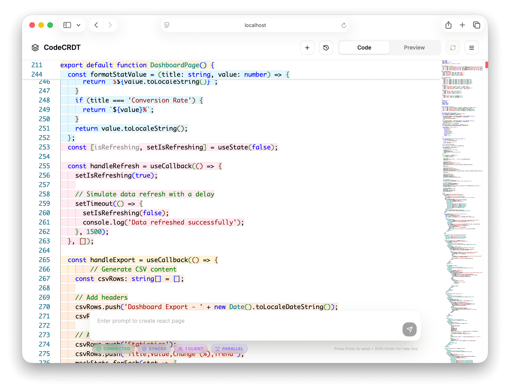
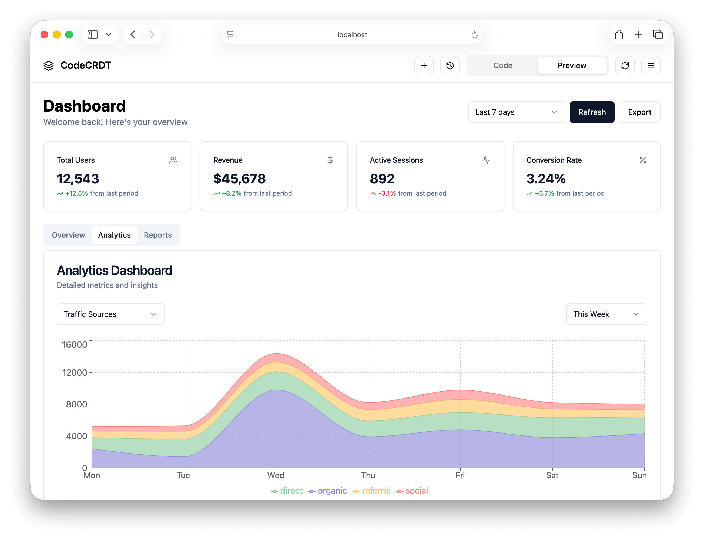
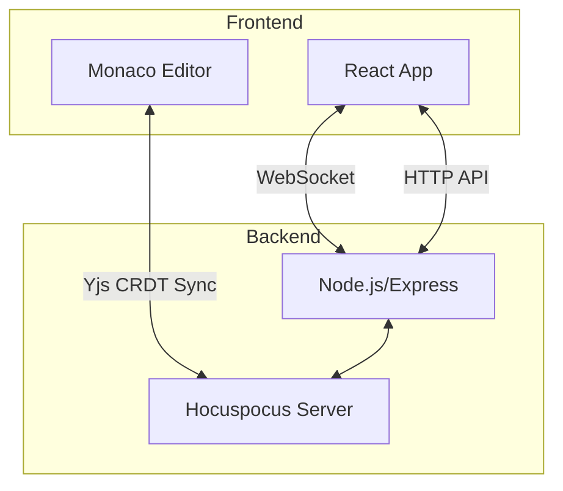

# CodeCRDT: Observation-Driven Coordination for Multi-Agent LLM Code Generation

**Research prototype demonstrating parallel multi-agent LLM coordination via CRDTs**

[](https://www.typescriptlang.org/)
[](https://react.dev/)
[](https://nodejs.org/)
[](https://yjs.dev/)

> Multi-agent LLM systems fail to realize parallel speedups due to costly coordination. CodeCRDT demonstrates an **observation-driven coordination pattern** where agents coordinate by monitoring shared state with observable updates and deterministic convergence, rather than through explicit message passing.

## 📄 Research Paper

**[SCIENCE.md](./SCIENCE.md)** - Detailed scientific documentation including methodology, results, and analysis

## 🔬 Key Findings

**Evaluation across 600 trials** (6 tasks, 50 runs per mode) using Claude Sonnet 4.5:

- **Task-dependent outcomes**: Parallel coordination achieves up to **21.1% speedup** on decomposable tasks but incurs up to **39.4% slowdown** on highly coupled tasks
- **Normalized efficiency**: When controlling for code volume, parallel is **faster per character for 5/6 tasks** (11-52% speedup)
- **Quality trade-offs**: +25% performance optimization but -7.7% code quality (LLM-based evaluation)
- **Zero character-level conflicts**: Strong eventual consistency guarantees 100% convergence (though 5-10% semantic conflicts require reconciliation)
- **Optimal configuration**: 3-5 agents for suitable tasks

## 🎬 System Demo

### Monaco Editor with Live Multi-Agent Coordination


_Multiple agents editing concurrently with colored cursors showing real-time CRDT synchronization_

### Live Preview


_Generated React application rendering in real-time as agents complete TODOs_

## 🚀 Quick Start

```bash
# Clone the repository
git clone https://github.com/spugachev/codecrdt.git
cd codecrdt

# Install and start backend
cd backend && npm install && npm run dev

# In a new terminal, install and start frontend
cd frontend && npm install && npm run dev
```

## 🔬 Research Contributions

1. **Observation-Driven Coordination for Stochastic LLM Agents**

   - Formalization with provable safety (TODO-claim protocol ensuring at-most-one agent per task)
   - Agents coordinate by monitoring shared CRDT state, not explicit message passing
   - Extends decades of shared-state coordination research (Linda, blackboard architectures, stigmergy) to autonomous LLMs

2. **Empirical Characterization of Parallel LLM Coordination**

   - 600-trial evaluation revealing task-dependent performance
   - Task structure (coupling) influences scalability—a finding not characterized in prior work
   - Normalized time analysis isolating coordination efficiency from code volume effects

3. **LLM-Specific Failure Mode Analysis**

   - 5-10% semantic conflicts despite 100% character-level convergence
   - Quality-performance trade-offs from local agent optimization
   - Identification of confounded factors (code volume inflation, LLM latency variability)

4. **Deployment Heuristics and Pattern Generalization**
   - When parallel coordination succeeds vs. fails based on task coupling
   - Pattern generalizes beyond CRDTs to any substrate with observable updates and deterministic convergence
   - Optimal agent configuration (3-5 agents) for suitable tasks

## ✨ Technical Features

- **🔄 CRDT-Based Synchronization** - Strong eventual consistency with zero character-level merge conflicts
- **🤖 Multi-Agent LLM Pipeline** - Outliner + parallel implementation agents with TODO-driven work decomposition
- **🎯 Slot-Based Position Anchors** - Zero-length CRDT ranges enable precise concurrent insertions
- **📡 Cursor-to-Code Protocol** - Tool-calling LLMs request CRDT positions and stream code directly
- **⚡ Real-Time TODO Detection** - CRDT observer identifies work items and routes to available agents
- **📊 Evaluation Harness** - Reproducible benchmark suite with statistical analysis (600 trials)
- **👁️ Live Visualization** - Monaco Editor frontend shows multi-agent coordination in real-time

## 📊 Empirical Results

**Meta-analyzed results** from 6 tasks × 50 runs per mode:

| Metric        | Sequential | Parallel | Δ (%)  | p-value | Effect Size (d_z) |
| ------------- | ---------- | -------- | ------ | ------- | ----------------- |
| Response Time | 60.92s     | 68.90s   | +13.1% | 0.022   | 0.13 (negligible) |
| Code Quality  | 17.13      | 15.81    | -7.7%  | <0.001  | -0.71 (medium)    |
| Performance   | 11.06      | 13.82    | +25.0% | <0.001  | 1.51 (large)      |
| Accessibility | 14.18      | 13.39    | -5.6%  | <0.001  | -0.59 (medium)    |

**Per-task breakdown** reveals high variability:

| Task         | Coupling | Response Time Δ | Normalized Time Δ |
| ------------ | -------- | --------------- | ----------------- |
| Tic-Tac-Toe  | Low      | -21.1% ✅       | -11.4% ✅         |
| Registration | Low      | -7.1% ✅        | -15.3% ✅         |
| Markdown     | Low      | -7.2% ✅        | +5.8% ⚠️          |
| Pomodoro     | High     | +35.9% ❌       | -25.3% ✅         |
| Dashboard    | High     | +29.1% ❌       | -34.8% ✅         |
| Visualizer   | High     | +39.4% ❌       | -51.8% ✅         |

**Key insight**: Normalized analysis shows parallel is faster per character for 5/6 tasks. Apparent slowdowns result from code generation volume inflation (82-189%), not coordination inefficiency.

## 🆚 Related Work Comparison

| Property             | Linda/Tuplespaces  | Blackboard        | Stigmergy       | **CodeCRDT**        |
| -------------------- | ------------------ | ----------------- | --------------- | ------------------- |
| Coordination         | Shared tuple space | Shared blackboard | Environment     | **Shared CRDT**     |
| Agent Type           | Deterministic      | Knowledge sources | Reactive robots | **Stochastic LLMs** |
| Consistency          | Atomic/locks       | Sequential        | Best-effort     | **Strong Eventual** |
| Convergence          | N/A (atomic)       | N/A (centralized) | Emergent        | **Deterministic**   |
| Safety Guarantees    | Via locking        | Via serialization | None            | **Formal (SEC)**    |
| Empirical Evaluation | No                 | Limited           | Simulation      | **600 trials**      |

**vs. Multi-Agent LLM Frameworks:**

- **ChatDev/MetaGPT**: Waterfall/pipeline workflows, no concurrent execution
- **CodeCRDT**: Parallel coordination with task-dependent outcomes (up to 21% speedup)

## 🏗️ Architecture

CodeCRDT uses a modern, scalable architecture:



### Core Components

**Backend (`backend/src/`):**

- `agents/` - Outliner, implementation, and sequential agents with LLM integration
- `core/` - CRDT connector, text writer, TODO observer, cursor tool, code output processor
- `api/` - Inference service, task routes, health endpoints
- `data/` - SQLite persistence for CRDT documents

**Frontend (`frontend/app/`):**

- `routes/` - React pages with Monaco Editor integration
- `hooks/` - Yjs collaboration hooks, CRDT synchronization
- `components/` - Live preview, message history, presence awareness

**Evaluation (`evaluation/src/`):**

- `evaluation/` - Evaluator, metrics collector, statistical analysis
- `prompts.yaml` - Benchmark suite (6 tasks spanning complexity spectrum)

### Tech Stack

**AI/LLM:**

- Amazon Bedrock (Claude Sonnet 4.5) - Agent inference
- Tool calling - Cursor navigation and code streaming
- Temperature 0 - Deterministic generation for evaluation

**CRDT Synchronization:**

- Yjs - Strong eventual consistency implementation
- Hocuspocus - Centralized WebSocket relay
- y-monaco - Monaco Editor binding
- Y.Text, Y.Map, Y.Array - Shared data types

**Development:**

- TypeScript - Type-safe implementation
- Express.js - Backend API
- React + React Router v7 - Frontend
- SQLite - Document persistence

## 🚀 Getting Started

### Prerequisites

- Node.js 18+ and npm
- Amazon Bedrock access (Claude Sonnet 4.5)
- Python 3.11+ with uv (for evaluation harness)

## 📦 Configuration

### Backend Environment Variables

Create a `.env` file in the backend directory:

```env
PORT=3001
NODE_ENV=development
CORS_ORIGIN=http://localhost:3000

# Amazon Bedrock Configuration (required for agents)
AWS_REGION=us-east-1
AWS_ACCESS_KEY_ID=your_access_key
AWS_SECRET_ACCESS_KEY=your_secret_key

# Agent Configuration
MAX_PARALLEL_AGENTS=5
AGENT_TIMEOUT_MS=120000
CRDT_SYNC_DELAY_MS=50
```

### Evaluation Configuration

See `evaluation/README.md` for detailed evaluation configuration options.

## 🔬 Reproducing Experiments

The evaluation harness provides reproducible experiments with statistical analysis:

```bash
cd evaluation

# Run full evaluation suite (600 trials, ~8-12 hours)
uv run python -m evaluation.evaluator \
  --mode both \
  --trials 50 \
  --prompts prompts.yaml

# Analyze results with statistical tests
uv run python -m evaluation.analyzer \
  --input results/ \
  --output analysis/

# Generate plots and tables
uv run python -m evaluation.visualizer \
  --input analysis/ \
  --output figures/
```

**Output includes:**

- Response time distributions with outlier analysis
- Code quality metrics (LLM-based and objective)
- Per-task breakdown with effect sizes
- Normalized time analysis (controlling for code volume)
- Statistical significance tests (Wilcoxon, Bonferroni correction)

### Project Structure

```
collaborative-agents/
├── backend/src/
│   ├── agents/              # LLM agent implementations
│   │   ├── outliner-agent.ts
│   │   ├── implementation-agent.ts
│   │   └── sequential-agent.ts
│   ├── core/                # CRDT coordination primitives
│   │   ├── crdt-connector.ts
│   │   ├── text-writer.ts
│   │   ├── todo-observer.ts
│   │   ├── cursor-tool.ts
│   │   └── code-output-processor.ts
│   ├── api/                 # REST API and inference service
│   │   ├── services/inference-service.ts
│   │   └── routes/v1/tasks.ts
│   └── data/                # SQLite persistence
├── frontend/app/
│   ├── routes/              # React pages
│   ├── hooks/               # Yjs collaboration hooks
│   └── components/          # UI components
├── evaluation/
│   ├── src/evaluation/      # Evaluation harness
│   │   ├── evaluator.py
│   │   ├── metrics.py
│   │   └── analyzer.py
│   ├── prompts.yaml         # Benchmark suite (6 tasks)
│   └── results/             # Experimental data (JSON)
├── paper/                   # MLSys 2026 submission
│   ├── src/paper-mlsys.tex
│   └── output/paper-mlsys.pdf
└── SCIENCE.md               # Scientific documentation
```

## 📊 Benchmark Suite

The evaluation includes 6 TypeScript/React tasks spanning the coupling spectrum:

| Task                 | Type         | Coupling    | LOC  | Complexity |
| -------------------- | ------------ | ----------- | ---- | ---------- |
| Tic-Tac-Toe Game     | Simple       | Low (<30%)  | ~130 | 3.0        |
| Registration Form    | Intermediate | Low (<30%)  | ~170 | 6.5        |
| Markdown Editor      | Intermediate | Low (<30%)  | ~180 | 7.0        |
| Pomodoro Timer       | Intermediate | High (>50%) | ~150 | 6.0        |
| Data Dashboard       | Complex      | High (>50%) | ~190 | 8.5        |
| Algorithm Visualizer | Complex      | High (>50%) | ~180 | 9.0        |

**Task coupling** operationalized as: fraction of TODOs requiring reading/modifying shared state from other TODOs.

## 🤝 Citation

If you use this work in your research, please cite:

```bibtex
@inproceedings{pugachev2025codecrdt,
  title={CodeCRDT: Observation-Driven Coordination for Multi-Agent LLM Code Generation},
  author={Pugachev, Sergey},
  booktitle={Conference on Machine Learning and Systems (MLSys)},
  year={2025}
}
```

## 🔧 Contributing

Contributions welcome! Areas for improvement:

- **Semantic conflict detection**: LSP integration, AST-level coordination
- **Multi-language support**: Beyond TypeScript/React
- **Scalability experiments**: N=1-20 agents
- **Alternative substrates**: OT, replicated logs, consensus systems
- **Human evaluation**: Validate LLM-based quality assessments

## 🐛 Known Limitations

- **Confounded measurements**: Code volume inflation affects response time interpretation
- **LLM variability**: ±21.57s variance despite temperature=0
- **Semantic conflicts**: 5-10% rate requires post-generation reconciliation
- **Task scope**: 6 UI tasks <100 LOC; generalization to large codebases unexplored
- **Human baseline**: No human expert comparison for quality metrics

## 🗺️ Future Work

See **[SCIENCE.md § Future Research Directions](./SCIENCE.md#future-research-directions)** for detailed roadmap including:

- Primitive comparison (CRDTs vs. OT vs. consensus)
- Semantic conflict detection and resolution
- Cross-file CRDT orchestration
- Adaptive agent scheduling based on task coupling
- Learning to decompose tasks optimally

## 📄 License

This project is licensed under the MIT License - see the [LICENSE](LICENSE) file for details.

## 🙏 Acknowledgments

We acknowledge the use of Claude Sonnet 4.5 (via Amazon Bedrock) for agent inference. The system relies on:

- **CRDT Infrastructure**: [Yjs](https://yjs.dev/), [Hocuspocus](https://tiptap.dev/hocuspocus)
- **Development Tools**: [Monaco Editor](https://microsoft.github.io/monaco-editor/), React, Express.js
- **Evaluation Stack**: NumPy, SciPy, Pandas, Matplotlib, Seaborn

We thank the open-source community for these foundational tools.

## 📞 Contact & Support

- **Issues**: [Report bugs or request features](https://github.com/spugachev/codecrdt/issues)
- **Discussions**: [Ask questions and share ideas](https://github.com/spugachev/codecrdt/discussions)
- **Author**: Sergey Pugachev ([ORCID 0009-0008-5134-6411](https://orcid.org/0009-0008-5134-6411))

---

<p align="center">
  <strong>CodeCRDT</strong><br>
  Observation-Driven Coordination for Multi-Agent LLM Systems<br>
  <em>Research prototype demonstrating parallel LLM coordination via CRDTs</em>
</p>
